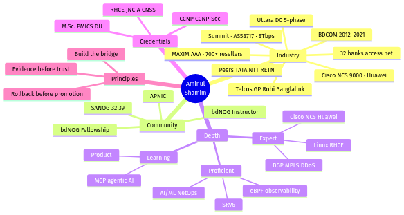

# Md. Aminul Islam · Shamim

**Carrier-grade network architect.** IIG / ISP / ITC backbone at multi-terabit scale.
13+ years operating ~8 Tbps of national internet capacity at [Summit Communications](https://summitcommunications.net) (AS58717).

---

---

## Currently

**Deputy Manager, IIG Gateway** · Summit Communications Ltd. · Dhaka, BD

- Operating **~40% of Bangladesh's internet traffic** across IIG, IX, PNI
- Leading a **360° Adaptive Threat Modulation (ATM)** system — inline DDoS + Layer 7 defense, AI/ML-assisted
- Architecting programmable networks — SRv6 evaluation, automation-first operations

## Selected work

### Carrier-grade / gateway
- **8+ Tbps national gateway operations** on Cisco NCS 9000 and Huawei platforms (AS58717) — **99.88% uptime** through fiber cuts, submarine cable shifts (SMW4/SMW5/SMW6), and trans-border outages
- **5-phase Uttara Data Center migration** — zero-downtime hot-swap of core routers, transit links, and submarine cable paths
- **National IIG platform swap** — Juniper/Cisco → Huawei (NE-40E, S8851)
- **IPv6 rollout** for Grameenphone, Robi, Banglalink
- **Submarine cable** planning · **Felicity IDC TIER-III** (OpenStack / F5) · **Starlink** integration
- **Upstream peers** — TATA, Bharti, NTT, RETN, Equinix, BBIX

### Enterprise / ISP / hosting
- **MAXIM AAA Radius billing** — scaled automated broadband infrastructure to **700+ internet resellers**, with DBBL Rocket payment integration
- **Bank access networks** — L2 access + redundant backup for ATM and EFT across **32 national commercial banks** (2014), using VPN, IPIP, GRE, and IPsec-over-GRE
- **CDN-backed media hosting** — Prothom Alo, NTV, BanglaTribune
- **IPTV / VoD streaming** and Asterisk/Issabel IPTSP voice systems

### Security / automation
- **DDoS mitigation** — BGP FlowSpec, RTBH, FlowShield, Python/Ansible off-ramp orchestration and cloud scrubbing
- **A525 SmartNet** — hybrid modular platform for automated threat detection, policy enforcement, remediation
- **Agentic observability** — Gemini API + eBPF research for fiber attenuation prediction, BGP route flap detection, automated RCA
- **Digital forensics blueprint** — SIEM telemetry, RPKI/ROA validation, chain-of-custody logging

## Domain

`BGP` `MPLS` `OSPF` `IS-IS` `IPv6` `SRv6` `IIG` `IX` `PNI` `CDN` `DDoS mitigation` `FlowSpec` `RTBH` `L7 firewall` `Palo Alto` `Fortinet` `F5` `Cisco NCS` `Huawei NE-40E` `Linux RHCE` `Python` `Ansible` `eBPF` `AI/ML for NetOps`

## Certifications

`CCNA` · `CCNP` · `CCNP Security` · `CCS-EAIl` · `CCS-Ecore` · `ICSI CNSS` · `MTCNA` · `MTCRE` · `JNCIA` · `RHCSA` · `RHCE`

## Community

- **bdNOG** — Instructor (bdNOG 11), Fellowship Committee (bdNOG 17)
- **SANOG** 32 · 39 · **APNIC** programs
- **M.Sc. Information & Cyber Security (PMICS)** — University of Dhaka, in progress

## Reach

[aminul-du.com](https://aminul-du.com) · [LinkedIn](https://linkedin.com/in/aminul-du) · [me@aminul-du.com](mailto:me@aminul-du.com)

---

Last updated 2026-09-14.
